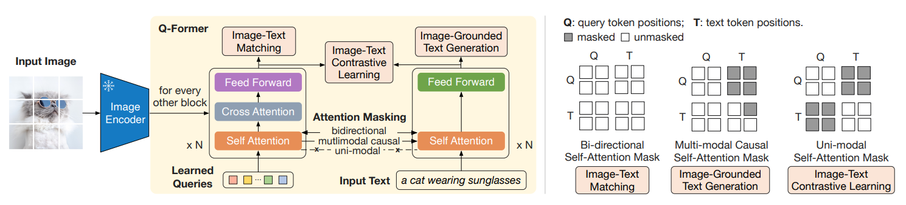

# BLIP Q-Former Tutorial

## Introduction

이 프로젝트는 **BLIP (Bootstrapping Language-Image Pretraining)** 모델의 핵심 모듈인  
**Q-Former (Query Transformer)** 학습 및 실험을 위한 코드 베이스입니다.  

Q-Former는 **이미지 인코더(ViT 등)**에서 추출한 시각적 토큰들을  
**학습 가능한 Query Token**과 교차 어텐션(cross-attention)을 통해 결합하여,  
텍스트와 이미지의 표현 공간을 효과적으로 정렬(alignment)합니다.

---

## Architecture

IMG (ViT) ─▶ Visual Feature ─┐
│
Query Token ──┼──▶ Q-Former (BERT-like Transformer)
│
Text (Tokenizer) ───────────┘

- **Image Encoder**: `ViT-B/16`, `EVA-CLIP`, `SigLIP` 등 사용 가능  
- **Q-Former**: BERT 구조 기반, Self-Attention + Cross-Attention 레이어 포함  
- **Text Encoder**: HuggingFace `BERT`/`RoBERTa`/`T5` 등 확장 가능  

---
## Reference

BLIP: Bootstrapping Language-Image Pre-training for Unified Vision-Language Understanding and Generation (Li et al., 2022)

BLIP-2: Bootstrapping Language-Image Pre-training with Frozen Image Encoders and Large Language Models (Li et al., 2023)

SEED-X: Multimodal Models with Unified Multi-granularity Comprehension and Generation
